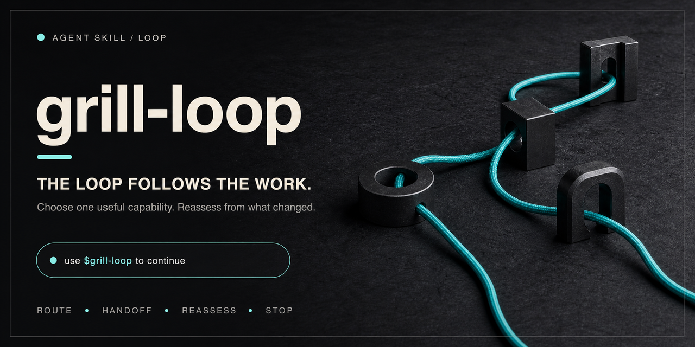

<p align="right"><a href="./README.md">中文说明</a></p>

<p align="center">
  
</p>

<h1 align="center">grill-loop</h1>

<p align="center"><strong>The loop follows the work.</strong></p>

<p align="center">
  One explicit router. One useful capability at a time.<br>
  Follow its contract, then choose again from what changed.
</p>

<p align="center">
  <a href="#install"></a>
  <a href="https://github.com/nxxxsooo/grill-loop/releases"></a>
  <a href="./LICENSE"></a>
</p>

## Install

One install includes `grill-loop`, `grilling`, `deep-grill`, and `what`:

```bash
npx skills@latest add nxxxsooo/grill-loop --skill grill-loop grilling deep-grill what -g -y
```

| Skill | Purpose | Source |
|---|---|---|
| `grill-loop` | Choose the next capability from the current goal and artifacts | This repository |
| `grilling` | Work a user-owned decision tree in native, dependency-aware question rounds | Local interaction overlay on [mattpocock/skills](https://github.com/mattpocock/skills/tree/v1.2.2/skills/productivity/grilling) |
| `deep-grill` | Audit a plan, idea, or implied approach autonomously and return a verdict | [nxxxsooo/deep-grill](https://github.com/nxxxsooo/deep-grill) |
| `what` | Pause and re-explain the latest update in the user's language | This repository |

Domain modeling, codebase design, TDD, Wayfinder, OpenSpec, Open Design, taste, and other specialists remain optional integrations supplied by the current environment. `CONTEXT.md` is also optional: `what` uses the nearest one when present and otherwise preserves the established project terms.

Wayfinder is an explicit, user-confirmed route for work that needs an issue-tracker decision map across sessions. The loop never invokes it silently. Specification and design are also choices, not mandatory follow-on stages after grilling or deep-grill.

When the user chooses OpenSpec, grill-loop checks whether the target project is initialized for the active client. Missing setup is generated only through `openspec init <project-root> --tools <active-client>`; the router does not fabricate OpenSpec files. The CLI remains an environmental prerequisite, and its reload or restart instruction applies before the generated entry point is used.

The explicit skill list is safe from a local maintainer checkout, where ignored project-local OpenSpec helpers may also be discoverable. The released GitHub source exposes exactly these four public skills. `--all` would also target every supported agent, which is a different operation.

Start the loop on any task with:

> Use $grill-loop to continue this task.

Name grill-loop once for a task. It then stays active across your answers until you stop it, change tasks, or finish the request. It does not auto-start on unrelated work or force every connected capability to run. During `grilling`, it uses the client's native question interface when the current mode provides one; otherwise it falls back to concise numbered questions.

### Optional: Raycast snippets

Raycast users can import [the bundled snippets](./skills/grill-loop/assets/raycast-snippets.json) with Raycast's **Import Snippets** command:

| Skill | Keyword |
|---|---|
| `grilling` | `;gr` |
| `deep-grill` | `;dg` |
| `grill-loop` | `;lp` |
| `what` | `;wt` |

The snippets paste the full prompts into any text field. Importing is opt-in; installing the skills never modifies a user's Raycast data. Raycast skips duplicates during import as described in its [official import documentation](https://manual.raycast.com/import-export).

## Why it exists

Real work does not follow one fixed methodology. A user-owned decision tree may need `grilling`; a plan, idea, or implied approach may need an autonomous `deep-grill`; a material transition may need a concise choice between stopping, specification, design, Wayfinder, direct implementation, or a specialist.

grill-loop owns only the routing decision. It selects the smallest useful next capability, follows that capability's own contract, carries forward the relevant context, then reassesses. Once implementation starts, vocabulary drift, an unclear module interface, slowing feedback, or proliferating shallow modules all become evidence to reroute.

## Route by where the answer lives

| The current gap | Useful next move |
|---|---|
| Materially different paths form a user-owned decision tree | `grilling`, working the current frontier in rounds |
| A plan, design, decision, idea, or implied approach needs autonomous investigation and adversarial review | `deep-grill` |
| Material terms are missing, overloaded, or contradicted by the code | `domain-modeling` or the relevant domain-modeling capability |
| The module interface, seam, or depth is unresolved and blocks delegation or testing | `codebase-design` or the relevant architecture capability |
| Behavior can be verified through an agreed public seam and needs a shorter feedback loop | `tdd` or the relevant short-feedback capability, one vertical slice at a time |
| The work needs a shared issue-tracker decision map across sessions, and the user confirms that route | `wayfinder` |
| The change needs a durable exploration, specification, implementation, or archival record | OpenSpec or another specification capability |
| The work is clear, fits one agent session, and needs no durable change record | Execute directly or use the active client's lightweight planning |
| The spec is implementable, but interface structure or visual direction remains unresolved | Open Design or another prototyping capability |
| A reviewable frontend or brand prototype needs visual direction or critique | `design-taste-frontend` or the relevant design specialist |
| Another specialist better fits the current move | That Skill or tool |

These are options, not stages. At a material transition, the native question interface presents the recommended route first, preserves a free-form clarification path, and lets the user stop. It asks nothing when the next move is already authorized, reversible, or the only viable route.

## Treat software fundamentals as rerouting evidence

[This article](https://mp.weixin.qq.com/s/QRA_MwrI4Loau8ZdsNF2Og) maps AI coding decay to lost shared design concepts, ubiquitous language, short feedback loops, and deep modules. That matches grill-loop's “one capability at a time, then reassess from changed artifacts” direction, while exposing a gap in the old contract: after implementation started, the Loop did not say clearly when to stop following the existing plan.

| Signal during implementation | Loop response |
|---|---|
| The human and agent mean different things by the same term | Read the existing glossary; enter domain modeling only when the model truly conflicts |
| The module's public promise and test seam cannot be stated first | Design the interface, depth, and seam before delegating the implementation |
| A change is too large to verify quickly | Shrink it to a verifiable vertical slice and choose TDD or the shortest available feedback loop |
| Shallow modules proliferate, knowledge scatters, or change slows down | Pause expansion, choose code review or an architecture-deepening capability, then reassess |

These signals are not new mandatory stages and do not require one fixed set of installed skills. They only mean that “keep executing as before” is no longer the smallest useful move; the selected capability still owns the concrete method through its own contract. See [Matt Pocock's Skills for Real Engineers](https://github.com/mattpocock/skills) for primary implementations of these ideas.

OpenSpec here is also not the Spec-to-Code regeneration loop criticized by the article: it preserves durable change intent and decisions, while apply still remains subordinate to real feedback and the Loop's reassessment.

An OpenSpec message saying “ready for `/opsx-apply`” is new evidence, not the Loop's terminal decision. If implementation still depends on unresolved interface design, give the spec to Open Design for a reviewable prototype, then route it through taste or another design specialist as their scope fits. Carry accepted structure, state, and visual decisions back into the OpenSpec design and tasks, confirm apply-readiness again, then implement. Backend-only changes, resolved designs, and work without a material design surface skip this branch.

When continued work would benefit from a persistent goal, grill-loop naturally proposes a compact, adaptable goal card in the current transition:

```text
Goal:
Project / sources of truth:
Boundaries (may change / must preserve):
Done when:
Must-pass real scenarios:
```

Fields that do not materially apply may be omitted. After the user agrees to the card, grill-loop uses the current client's native goal mechanism and keeps choosing the next useful capability until the goal is met. It pauses only when progress needs new user input or authority, and keeps no goal state of its own. Otherwise, it stops when the request is fulfilled or further looping has diminishing returns.

<p align="center">
  
</p>

## The complete contract

The router itself is only six paragraphs. This excerpt is kept in exact sync with [`skills/grill-loop/SKILL.md`](./skills/grill-loop/SKILL.md):

<!-- grill-loop-skill-body:start -->
> # Grill Loop
>
> An explicit invocation opens grill-loop for the current task. Keep the loop active across later user replies; the user does not need to name `grill-loop` or the selected capability again. A short answer to a loop or grilling question is a continuation, not a new task. On each reply, resume the selected capability while its contract is incomplete, then reassess from what changed. End the loop when the user stops, clearly changes tasks, or the request is fulfilled.
>
> Follow the user's goal and the latest evidence or artifacts. Choose the smallest useful capability, follow its contract, then reassess from what changed. Treat a capability's suggested next command as evidence, not as the loop's decision. During implementation, vocabulary drift, an unclear module interface, slowing feedback, or accumulating shallow modules are evidence to reroute. Briefly explain each transition; the user may choose another route or stop at any time.
>
> Use `grilling` when materially different paths form a user-owned decision tree: work every currently unblocked frontier question in rounds and wait for the user's decisions. Use `deep-grill` when the agent can audit a plan, design, decision, idea, or implied approach autonomously and return a verdict and revisions. Keep one or two bounded user choices inside the current capability. Use a domain-modeling capability only when material terms are missing, overloaded, or contradicted by the work; an existing coherent glossary or `CONTEXT.md` is context, not a mandatory stage. Use architecture, codebase-design, TDD, prototyping, taste, or another specialist when its specific unresolved problem is now the smallest useful move.
>
> Treat Wayfinder, specification, design, and implementation as optional routes, not fixed stages. Offer `wayfinder` only when it is available, the work needs an issue-tracker decision map across sessions, and the user confirms that route; never invoke it implicitly. Offer OpenSpec or another specification capability when a durable change record is useful. If OpenSpec is selected, follow its contract and official CLI; never fabricate its setup. Offer design or prototyping when a material interface or visual decision needs review. Execute directly when the work is clear, authorized, and needs neither a durable map nor a specification artifact.
>
> After a capability or phase produces a usable result, ask about the next route only when the choice materially depends on user intent. Use the active client's native question tool when available. Show two or three context-specific options: put the recommended route first, include the strongest viable alternative when useful, and allow `Stop here`. Treat the native free-form answer as `Help me clarify`; if no free-form answer exists, replace the weakest option with `Help me clarify`. Show only available, relevant routes, such as specification, design or prototype, Wayfinder, direct implementation, or a specialist. If no native question tool exists, ask the same concise question in prose. Continue without asking when the next move is factual, reversible, already authorized, or the only viable route.
>
> Load only what the current move needs. Carry forward the goal, confirmed decisions, constraints, and artifact references, but impose no shared output format and maintain no duplicate workflow state. Preserve every capability's scope, authority, and safety boundaries. Add no custom gates, hooks, background processes, or state files. When sustained work needs a goal, propose this adaptable card in the current transition: `Goal`, `Project / sources of truth`, `Boundaries (may change / must preserve)`, `Done when`, and `Must-pass real scenarios`; omit irrelevant fields. After user approval, register it with the active client's native goal mechanism when available and keep routing until it is met. Otherwise, stop when the request is fulfilled or returns diminish.
<!-- grill-loop-skill-body:end -->

## Boundaries

- No mandatory order or lifecycle.
- No shared output schema or duplicate task state.
- No custom gates, hooks, background processes, or state files.
- After the user accepts a proposed goal, native clients may persist it; grill-loop never duplicates that goal state.
- No authority beyond the user's request and the selected capability's contract.
- No automatic initial invocation; an explicitly started loop continues for that task until its stop conditions are met.

## Update

Installed copies do not follow repository changes automatically:

If the existing copy came from `v1.2.0` or an earlier single-skill layout, its lock still points to the repository-root `SKILL.md`. Rebind the source once when migrating to the four-skill bundle:

```bash
npx skills@latest add nxxxsooo/grill-loop --skill grill-loop grilling deep-grill what -g -y
```

After migration, use the normal update command:

```bash
npx skills@latest update grill-loop grilling deep-grill what -g -y
```

Use `-p` instead of `-g` for a project-scoped installation.
Start a fresh task or reload the client after installation when the current task has already cached skill metadata.

## License

This repository, `deep-grill`, and `what` use the [MIT License](./LICENSE). The local `grilling` overlay preserves Matt Pocock's upstream contract and retains its MIT license and source attribution; see [`THIRD_PARTY_NOTICES.md`](./THIRD_PARTY_NOTICES.md).
