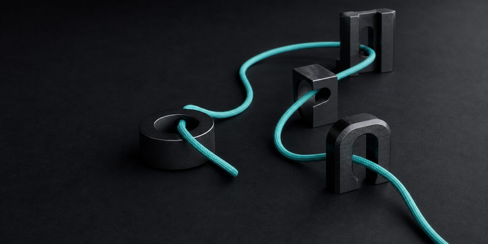
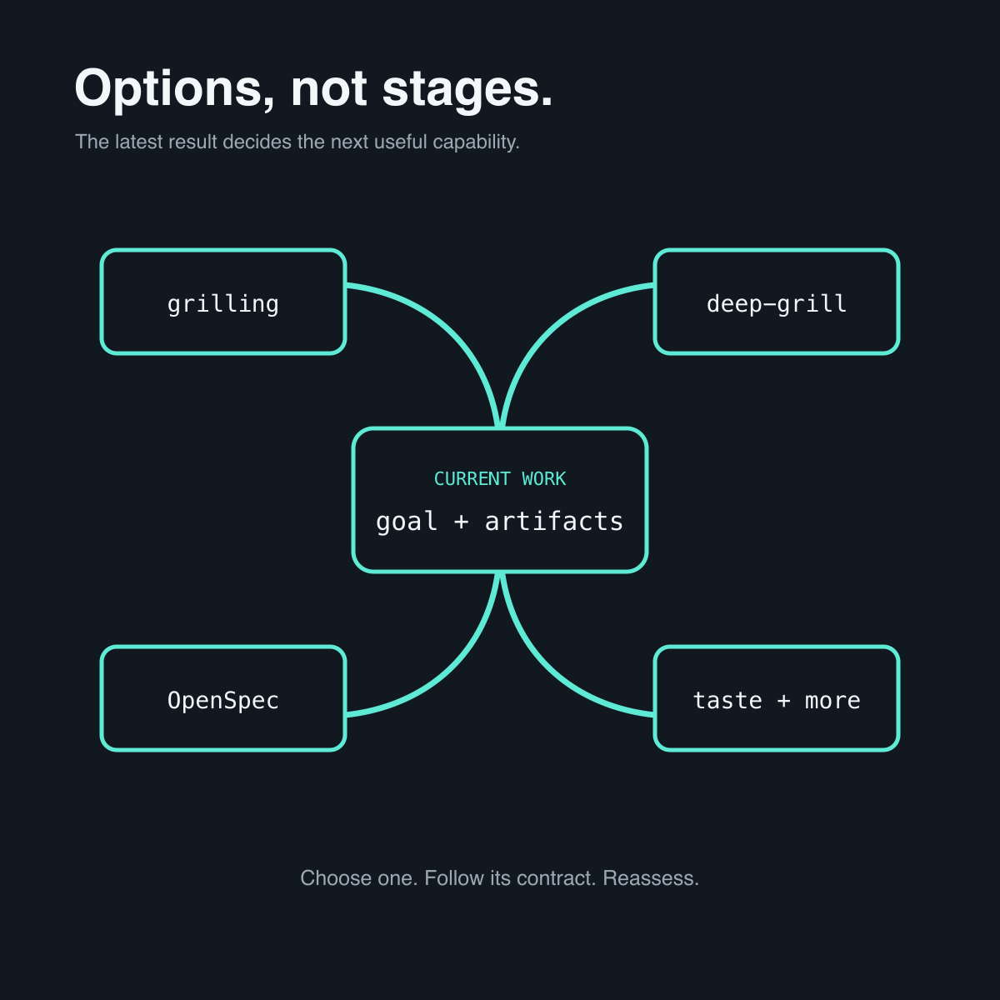
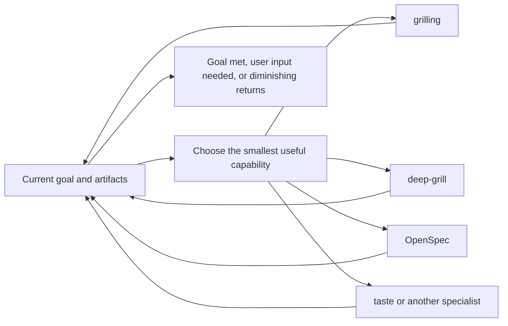

<p align="right">
  <a href="./README.zh-CN.md"></a>
</p>

<p align="center">
  
</p>

<h1 align="center">grill-loop</h1>

<p align="center"><strong>The loop follows the work.</strong></p>

<p align="center">
  An explicit Agent Skill that chooses the smallest useful capability,<br>
  follows its own contract, then reassesses from what changed.
</p>

<p align="center">
  <a href="#quickstart"></a>
  <a href="./LICENSE"></a>
  <a href="./README.zh-CN.md"></a>
</p>

Real work rarely follows one perfect methodology. A vague idea may need one focused interview, a drafted plan may need adversarial review, a durable change may belong in OpenSpec, and a frontend artifact may need a taste pass.

**grill-loop connects those capabilities without turning them into another framework.** It looks at the current goal and artifacts, invokes only the smallest useful capability, carries forward the relevant context, and chooses again.

## The entire skill

grill-loop is four paragraphs. This is the complete [`SKILL.md`](./SKILL.md) body you install:

<!-- grill-loop-skill-body:start -->
> # Grill Loop
>
> Follow the user's goal and the latest evidence or artifacts. Choose the smallest next useful capability, load and follow its own contract, then reassess from what changed. Briefly explain each transition; the user may choose the next capability at any time.
>
> Use `grilling` when a material answer lives only in the user's intent, priorities, risk tolerance, or taste. Use `deep-grill` when a plan or decision needs autonomous investigation and adversarial review. Use OpenSpec when the work should enter or continue durable exploration, specification, implementation, or archival. Use `design-taste-frontend` when a relevant frontend or brand surface needs visual direction or critique. Use another available skill or tool when it is a better next move.
>
> Treat these as options, not stages. Skip, repeat, reorder, or return to them freely. Load only what the current move needs. Carry forward the goal, confirmed decisions, constraints, and artifact references, but impose no shared output format and maintain no duplicate workflow state.
>
> Preserve every capability's own scope, authority, and safety boundaries. Add no custom gates, hooks, background processes, or state files. Stop when the user's goal is met, a meaningful next move requires their input or authority, or further looping has diminishing returns.
<!-- grill-loop-skill-body:end -->

What each paragraph buys you:

- **Pick one useful move.** Start from the current goal and artifact, not a fixed lifecycle.
- **Route by where the answer lives.** User intent, autonomous review, durable specification, visual taste, or another specialist each keeps its own owner.
- **Move freely.** Skip, repeat, reorder, or return without inventing a shared schema.
- **Keep the loop light.** Preserve authority boundaries and stop when the work is done or no longer improving.

## Quickstart

1. Install the Skill:

   ```bash
   npx skills@latest add nxxxsooo/grill-loop
   ```

2. Continue an existing task or start with an idea.

3. Say:

   > Use $grill-loop to continue this task.

> [!TIP]
> grill-loop is explicit-only. Naming it selects the router; it does not force every capability to run.

## Options, not stages

<p align="center">
  
</p>

| What the work needs now | Useful capability |
| --- | --- |
| A material answer exists only in the user's head | `grilling` |
| A plan needs investigation and its strongest objection | `deep-grill` |
| Work should become or update durable change artifacts | OpenSpec |
| A frontend or brand surface needs visual direction or critique | `design-taste-frontend` |
| Another specialist is a better next move | That Skill or tool |

These are defaults, not a sequence. A real task may move from `deep-grill` to OpenSpec, then to taste, back to implementation, or stop after one useful answer.

## How it moves



At every transition, grill-loop passes only the relevant goal, confirmed decisions, constraints, and artifact references. The selected capability keeps its own workflow and safety contract.

## What it does not add

- No mandatory order or lifecycle.
- No shared output format or duplicated task list.
- No custom gates, hooks, background processes, or state files.
- No authority beyond what the user granted and the selected capability permits.
- No automatic invocation.

## Update

Installed copies do not follow GitHub commits or Releases automatically. Update a global installation with:

```bash
npx skills@latest update grill-loop -g -y
```

Use `-p` instead of `-g` for a project-scoped installation. Here, `skills@latest` selects the npm-hosted installer version; the Skill content still comes from this GitHub repository.

## Manual installation

For a manual Claude Code installation:

```bash
git clone https://github.com/nxxxsooo/grill-loop ~/.claude/skills/grill-loop
```

## License

[MIT](./LICENSE)
