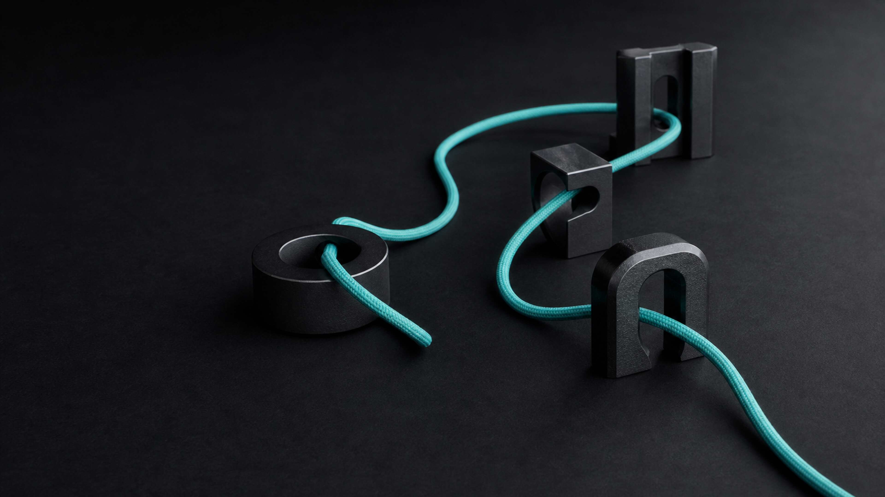

<p align="right"><a href="./README.en.md">English</a></p>

<p align="center">
  
</p>

<h1 align="center">loop</h1>

<p align="center"><strong>一次触发，三个深循环，交付可验证结果。</strong></p>

<p align="center">
  <a href="#安装"></a>
  <a href="https://github.com/nxxxsooo/loop/releases"></a>
  <a href="./LICENSE"></a>
</p>

`loop` 是持久的产品工作编排器：一次触发后，普通回复持续当前子循环，按产物就绪状态从想法推进到已验证结果。安装了 Superpowers 时，日常执行默认走 Superpowers，`loop` 隐式承接完整生命周期，不必显式点名；`what` 负责跨工作流的解释与续接控制。两者都不创建第二份持久计划。

```text
想法 -> deep-grill -> Product Brief
     -> deep-design -> Build Contract
     -> deep-build -> 已验证结果
```

## 安装

推荐使用引导安装。依次安装完整 loop bundle 和 `deep-design` 使用的 `design-taste-frontend`；两次选择相同的 Agent、Project／Global 和 Symlink／Copy：

```bash
npx skills@latest add nxxxsooo/loop --skill '*'
npx skills@latest add Leonxlnx/taste-skill --skill design-taste-frontend
```

需要直接完成全局安装时：

```bash
npx skills@latest add nxxxsooo/loop --skill '*' -g -y
npx skills@latest add Leonxlnx/taste-skill --skill design-taste-frontend -g -y
```

快速安装会跳过提示，并按 `skills` CLI 的 Agent 检测结果全局安装完整 bundle 与 Taste Skill。

直接描述想法或明确说 `$loop` 都可以启动这条产品生命周期：

> 使用 $loop 把这个想法推进到设计和实现。

后续普通回复会继续当前子循环。你也可以单独调用任意 `deep-*` Skill；直接调用只完成该项工作，不会自动开启完整生命周期。

## Bundle 内容

| Skill | 负责内容 | 就绪条件 |
|---|---|---|
| `loop` | 隐式可用的产品生命周期与产物迁移 | 用户要求的终点完成 |
| `deep-grill` | 想法澄清和对抗性审查 | Product Brief 或审查结论确认 |
| `deep-design` | 产品规格与实现设计 | Build Contract 确认 |
| `deep-build` | 实现、验证和授权范围内的交付 | 必过场景成功 |
| `what` | 解释当前工作前沿并等待续接选择 | 用户继续、调整下一步或停止 |

## `?` 与 `$what`：解释后再续接

在任一活跃工作流中，整条消息只有：

```text
?
```

或显式调用 `$what`，都会由独立的 `what` Skill 暂停当前动作。它会说明最后确认点、当前工作流和步骤、已变化的产物、这些状态的重要性，以及原本准备执行的下一步。普通句子里包含 `?` 不会触发；没有活跃工作流时，`?` 没有特殊含义。

解释后，`what` 必须等待你选择「继续（推荐）」「调整下一步」或「停止」；只有选择继续，才会执行原本的下一步。`request_user_input` 当前可调用时使用本地化原生界面；不可调用时立即在当前模式用同语言的简洁文字给出相同选择。不会为了提问或续接要求切换到 Plan mode。

## 原生问题工具

`deep-grill` 和 `deep-design` 用当前客户端的原生问题界面处理归用户所有的实质决定。`request_user_input` 当前可调用时直接使用；当前模式不可调用、客户端不支持，或你明确选择文字时，立即用同语言的简洁问题继续，不暂停等待模式切换。两者会保留待决分支和推荐项，并接受普通回复继续同一决策树。

## 规格与设计

`deep-design` 负责完整的规格和设计过程。Superpowers 在可用时提供日常 TDD、调试、评审和验证方法，但不应额外创建持久计划。相关 OpenSpec change 已经活跃时，它的 artifacts 是唯一的实体 Build Contract 和任务状态；仅初始化了 OpenSpec 不会触发新 change。只有用户明确要求，或工作属于耐久、多会话、跨组件、迁移、安全、重要架构或需要长期交接的范围，才创建或使用新的 OpenSpec change。

领域、架构、前端、测试和交付等专家能力由当前子循环按需调用，用户无需管理内部路由。

其中，落地页、作品集、编辑型页面或视觉改版出现实质视觉设计问题时，`deep-design` 会在可用时默认加载 `design-taste-frontend`；仪表盘、数据表和多步骤产品界面不走该 Skill。

### UI 设计与重构

`deep-design` 同时承接新 UI、局部重构和完整重构：确认范围与保留行为，选择产品／UI／两者／不做外部研究，提供有真实图片和逐项反馈的参考板，视觉选择可在环境允许时走本地浏览器实时评审，收敛视觉与交互方向，再决定是否先做高保真预览。已确认的选择直接复用，后端任务跳过这些 UI 步骤。

按需使用独立安装的 `ui-research` 做参考研究，使用可用的 `react-bits` 集成能力查询免费动效组件；这些不是 bundle 的硬依赖，缺失时可以直接研究官方来源。研究数量、付费页面和特定客户端模式不会成为额外门槛。旧 `rebuild-ui-design` 的流程已融入，无需另装该 Skill。

所有决定进入同一份 Build Contract。`deep-build` 负责实际页面、浏览器交互和截图验证；大范围重构先验收一个代表性完整流程，再迁移剩余页面。预览修订不会被当作批准，也不会因为研究了某个组件就自动安装它。

参考方法见 [UI 工作流](skills/deep-design/references/ui-design-workflow.md) 和 [视觉证据](skills/deep-design/references/visual-evidence.md)。

## 完整 loop 契约

以下内容与 [`skills/loop/SKILL.md`](./skills/loop/SKILL.md) 保持完全一致：

<!-- loop-skill-body:start -->
> # Loop
>
> Own progression, not the child methods. Route the active product task through three artifact contracts:
>
> ```text
> deep-grill -> confirmed Product Brief
> deep-design -> confirmed Build Contract
> deep-build -> verified result
> ```
>
> ## Keep The Loop Active
>
> A fresh loop starts when the user invokes `loop` or clearly asks to run this product lifecycle. After that, treat every ordinary reply as a continuation of the same loop until the goal is achieved, the user stops, the user clearly changes tasks, or further work requires authority outside the original request. The user does not need to name `loop` or any child again.
>
> Resume the current child while its output contract is incomplete. When its artifact is confirmed, select the next child from artifact readiness without asking the user to nominate a skill or choose a route. State the transition briefly and continue in the same response when the next action is already authorized. Artifact readiness chooses the child; it does not expand the user's authority or the requested endpoint.
>
> ## Route By Artifact Readiness
>
> - Use `deep-grill` when no confirmed Product Brief exists, when root product intent is unresolved, or when the requested endpoint is an isolated adversarial audit. Discovery mode produces the Product Brief; audit mode may finish without advancing when an audit is the whole request.
> - Use `deep-design` when the Product Brief is confirmed but no confirmed Build Contract exists.
> - Use `deep-build` when the Build Contract is confirmed and implementation is authorized.
> - Resume the same child when its contract is incomplete, even after a mode switch, clarification, or ordinary user answer.
> - Return an invalidated artifact to the child that produces it. A root product contradiction returns to `deep-grill`; a material behavior, interface, task, or verification gap returns to `deep-design`.
> - Honor a direct invocation of a child skill. Direct use does not require `loop`, but it also does not activate the persistent loop unless the user invokes `loop` or clearly asks to run this product lifecycle.
>
> The active child selects any domain, architecture, research, interface, visual-design, testing, deployment, or other specialist it needs. The user does not manage internal routing.
>
> ## Preserve One Source Of State
>
> Carry the goal, current child, confirmed artifacts, constraints, authority, and evidence through the conversation and artifact references. For sustained work, use the active client's native goal or plan mechanism when available. Do not create duplicate workflow state, custom gates, hooks, or background processes.
>
> Never imitate a child contract inside `loop`. Delegate the work, accept its artifact only when its readiness rules are met, and reroute from evidence. Stop when the requested endpoint is complete, the user stops or changes tasks, progress requires new authority, or remaining work has diminishing returns.
<!-- loop-skill-body:end -->

## Raycast

导入 [`skills/loop/assets/raycast-snippets.json`](./skills/loop/assets/raycast-snippets.json)，即可使用 `loop ;lp`、`deep grill ;dg`、`deep design ;dd`、`deep build ;db` 和 `what ;wt`。下面的 bundle 刷新命令会更新已安装的 Skill 和这个 JSON 文件，但不会修改已经导入 Raycast 的条目；导入后请在 Raycast 中原位更新这五条，避免留下旧版 loop `?` 文案或重复入口。

## 更新

已安装副本是快照：

```bash
# 发布后用幂等安装刷新整个 loop bundle，并发现新增的 bundled Skill
npx skills@latest add nxxxsooo/loop --skill '*' -g -y

# Taste 是独立上游 Skill，按自己的更新路径刷新
npx skills@latest update design-taste-frontend -g -y
```

`update loop` 只会按现有 lock 记录更新 `loop` 本身，不能发现旧安装中不存在的 `what`，也不会刷新同 bundle 的其他 Skill。因此，每次 release 后都使用上面的 bundle `add` 命令；它可重复安全运行，并确保整套 bundle 同步。

如果客户端已经缓存 Skill 元数据，请重新加载或新建任务。

## 许可证

本 bundle 使用 [MIT License](./LICENSE)。`deep-grill` 保留已整合上游源码的归属信息，见 [`THIRD_PARTY_NOTICES.md`](./THIRD_PARTY_NOTICES.md)。`design-taste-frontend` 从 [`Leonxlnx/taste-skill`](https://github.com/Leonxlnx/taste-skill) 独立安装，不属于本 bundle，其许可证与更新由上游管理。
