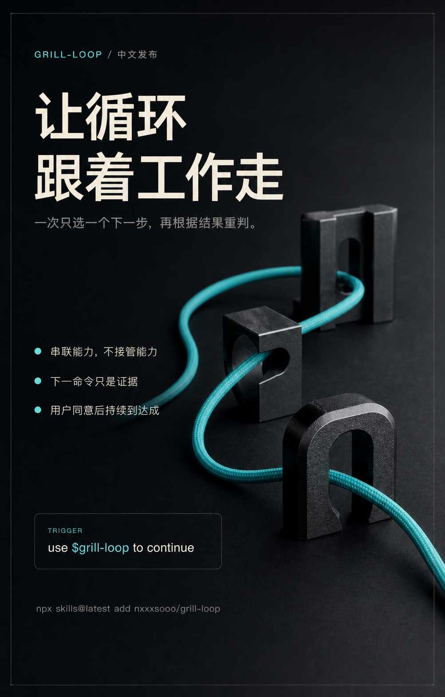

<p align="right"><a href="./README.en.md">English</a></p>

<p align="center">
  
</p>

<h1 align="center">grill-loop</h1>

<p align="center"><strong>让循环跟着工作走。</strong></p>

<p align="center">
  一个显式路由器，每次只选一个有价值的能力。<br>
  遵循它自己的契约，再根据变化重新选择。
</p>

<p align="center">
  <a href="#安装"></a>
  <a href="https://github.com/nxxxsooo/grill-loop/releases"></a>
  <a href="./LICENSE"></a>
</p>

## 安装

一次安装包含 `grill-loop`、`grilling`、`deep-grill` 和 `what`：

```bash
npx skills@latest add nxxxsooo/grill-loop --skill grill-loop grilling deep-grill what -g -y
```

| Skill | 作用 | 来源 |
|---|---|---|
| `grill-loop` | 根据当前目标和产物选择下一项能力 | 本仓库 |
| `grilling` | 按依赖关系分轮处理属于用户的决策树 | [mattpocock/skills](https://github.com/mattpocock/skills/tree/v1.2.2/skills/productivity/grilling) |
| `deep-grill` | 自主审查方案、想法或隐含路线，并给出结论 | [nxxxsooo/deep-grill](https://github.com/nxxxsooo/deep-grill) |
| `what` | 暂停推进，用用户的语言重新解释最新进展 | 本仓库 |

领域建模、代码库设计、TDD、Wayfinder、OpenSpec、Open Design、taste 和其他专家能力按当前环境选用，不强制打包。`CONTEXT.md` 也是可选项：存在时，`what` 会读取最近的一份；不存在时，它沿用当前对话和产物中的既有术语。

Wayfinder 是需要用户明确确认的可选路线，适合跨会话、需要 Issue 决策地图的工作。Loop 不会静默触发它。规格和设计同样是 grilling 或 deep-grill 之后可选的路线，不是必经阶段。

用户选择 OpenSpec 后，grill-loop 才检查目标项目是否已为当前客户端初始化。缺失配置只通过 `openspec init <project-root> --tools <active-client>` 生成，路由器不会手工拼装 OpenSpec 文件。OpenSpec CLI 仍需由当前环境提供；使用生成的入口前，应按 CLI 提示重新加载或重启客户端。

显式列出 skill 可以避开维护者本地 checkout 中可能被发现、但已被 Git 忽略的项目级 OpenSpec helper。GitHub 发布源只暴露这四个公开 skill。`--all` 还会安装到所有受支持的 agent，不是同一个意思。

然后在任意任务中明确说：

> 使用 $grill-loop 继续这个任务。

grill-loop 只在被点名时运行。它不会自动触发，也不会强迫所有关联能力都执行。

### 可选：Raycast snippets

如果使用 Raycast，可通过 Raycast 的「Import Snippets」命令导入[随包提供的 snippets](./skills/grill-loop/assets/raycast-snippets.json)：

| Skill | 关键词 |
|---|---|
| `grilling` | `;gr` |
| `deep-grill` | `;dg` |
| `grill-loop` | `;lp` |
| `what` | `;wt` |

这些 snippets 会粘贴完整提示词，适用于任何文本输入框。导入是可选操作；安装 skill 不会修改用户的 Raycast 数据。重复项由 Raycast 在导入时跳过，具体行为参见 [Raycast 官方导入说明](https://manual.raycast.com/import-export)。

## 为什么需要它

真实工作不会沿着一套固定方法前进。属于用户的完整决策树可能需要 `grilling`；方案、想法或隐含路线可能需要自主 `deep-grill`；重要交接则可能需要用户在停止、规格、设计、Wayfinder、直接实施或专家能力之间做一次简洁选择。

grill-loop 只拥有路由决定。它选择当前最小且有价值的能力，遵循该能力自己的契约，传递必要上下文，再重新判断下一步。进入实施后，共享术语漂移、模块接口不清、反馈变慢或浅层模块增殖，都会成为重新路由的证据。

## 按答案所在位置路由

| 当前缺口 | 适合的下一步 |
|---|---|
| 多条实质路线形成属于用户的决策树 | `grilling`，按轮处理当前 frontier |
| 方案、设计、决策、想法或隐含路线需要自主调查和对抗审查 | `deep-grill` |
| 关键术语缺失、含混，或与代码表达矛盾 | `domain-modeling` 或对应领域建模能力 |
| 模块接口、seam 或 depth 尚未解决，并阻碍委托或测试 | `codebase-design` 或对应架构能力 |
| 行为可通过已确认的公开 seam 验证，需要缩短反馈循环 | `tdd` 或对应短反馈能力，一次一个纵向切片 |
| 工作跨越多个会话、需要共享 Issue 决策地图，并且用户确认该路线 | `wayfinder` |
| 改动需要持久的探索、规格、实施或归档记录 | OpenSpec 或其他规格能力 |
| 工作已经明确、单个 agent 会话可完成，且不需要持久变更记录 | 直接执行或使用当前客户端的轻量计划 |
| 规格已可实施，但用户界面结构或视觉方向仍未解决 | Open Design 或其他原型能力 |
| 可评审的前端或品牌原型需要视觉方向或批评 | `design-taste-frontend` 或对应设计专家 |
| 其他专家更适合当前动作 | 对应 Skill 或工具 |

这些是选项，不是阶段。重要交接时，原生问题界面会把推荐路线放在首位，保留自由输入的澄清入口，并允许用户停止。若下一步已经获得授权、可逆或只有一条可行路线，则不提问。

## 把软件基础当作重新路由的证据

[这篇文章](https://mp.weixin.qq.com/s/QRA_MwrI4Loau8ZdsNF2Og)把 AI 编码退化映射到共享设计概念、统一语言、短反馈循环和深层模块。它与 grill-loop 的「每次只选一项能力、产物变化后重判」方向一致，也暴露了旧契约的空白：进入实施后，Loop 没有明确说明何时应停止照着原计划继续写。

| 实施中出现的信号 | Loop 的响应 |
|---|---|
| 人与 agent 对同一个词理解不同 | 读取已有 glossary；确有模型冲突时再进入领域建模 |
| 无法先说清模块对外承诺和测试 seam | 先设计 interface、depth 与 seam，再委托 implementation |
| 一次改动大到无法快速验证 | 缩成可验证的纵向切片，选择 TDD 或最短可用反馈循环 |
| 新增大量浅层模块、知识散落或改动越来越慢 | 暂停扩张，选择代码评审或架构深化能力，再重新判断 |

这些信号不是新的强制阶段，也不要求环境安装固定的一组 skill。它们只说明「继续照旧执行」已经不是最小且有价值的动作；具体方法仍由当前环境中被选能力的契约拥有。相关一手实现可参考 [Matt Pocock 的 Skills for Real Engineers](https://github.com/mattpocock/skills)。

这里的 OpenSpec 也不是文章批评的 Spec-to-Code 再生成器：它保存持久的变更意图与决策，但进入 apply 后仍要服从真实反馈和 Loop 的重新判断。

OpenSpec 输出「ready for `/opsx-apply`」只是新的证据，不是 Loop 的终点。若实现仍依赖未解决的用户界面设计，先把规格交给 Open Design 形成可评审原型，再按适用范围交给 taste 或其他设计专家复核；将确认后的结构、状态与视觉决策回写 OpenSpec 的 design 和 tasks，重新确认 apply-ready 后再实施。纯后端、设计已明确或没有重要设计面的变更直接跳过这条支路。

当后续工作适合用持久 goal 推进时，grill-loop 会在当前交接中自然提出一张简洁、可裁剪的 goal card：

```text
Goal:
Project / sources of truth:
Boundaries (may change / must preserve):
Done when:
Must-pass real scenarios:
```

确实不适用的字段可以省略。用户同意整张 card 后，它调用当前客户端已有的原生 goal 机制，并持续选择下一项有价值的能力，直到目标达成；只有继续推进需要新的用户输入或授权时才暂停。它不维护自己的 goal 状态。否则，请求完成或继续循环的收益已经很低即可停止。

<p align="center">
  
</p>

## 完整契约

路由器本身只有五段话。以下内容与 [`skills/grill-loop/SKILL.md`](./skills/grill-loop/SKILL.md) 保持逐字同步：

<!-- grill-loop-skill-body:start -->
> # Grill Loop
>
> Follow the user's goal and the latest evidence or artifacts. Choose the smallest useful capability, follow its contract, then reassess from what changed. Treat a capability's suggested next command as evidence, not as the loop's decision. During implementation, vocabulary drift, an unclear module interface, slowing feedback, or accumulating shallow modules are evidence to reroute. Briefly explain each transition; the user may choose another route or stop at any time.
>
> Use `grilling` when materially different paths form a user-owned decision tree: work every currently unblocked frontier question in rounds and wait for the user's decisions. Use `deep-grill` when the agent can audit a plan, design, decision, idea, or implied approach autonomously and return a verdict and revisions. Keep one or two bounded user choices inside the current capability. Use a domain-modeling capability only when material terms are missing, overloaded, or contradicted by the work; an existing coherent glossary or `CONTEXT.md` is context, not a mandatory stage. Use architecture, codebase-design, TDD, prototyping, taste, or another specialist when its specific unresolved problem is now the smallest useful move.
>
> Treat Wayfinder, specification, design, and implementation as optional routes, not fixed stages. Offer `wayfinder` only when it is available, the work needs an issue-tracker decision map across sessions, and the user confirms that route; never invoke it implicitly. Offer OpenSpec or another specification capability when a durable change record is useful. If OpenSpec is selected, follow its contract and official CLI; never fabricate its setup. Offer design or prototyping when a material interface or visual decision needs review. Execute directly when the work is clear, authorized, and needs neither a durable map nor a specification artifact.
>
> After a capability or phase produces a usable result, ask about the next route only when the choice materially depends on user intent. Use the active client's native question tool when available. Show two or three context-specific options: put the recommended route first, include the strongest viable alternative when useful, and allow `Stop here`. Treat the native free-form answer as `Help me clarify`; if no free-form answer exists, replace the weakest option with `Help me clarify`. Show only available, relevant routes, such as specification, design or prototype, Wayfinder, direct implementation, or a specialist. If no native question tool exists, ask the same concise question in prose. Continue without asking when the next move is factual, reversible, already authorized, or the only viable route.
>
> Load only what the current move needs. Carry forward the goal, confirmed decisions, constraints, and artifact references, but impose no shared output format and maintain no duplicate workflow state. Preserve every capability's scope, authority, and safety boundaries. Add no custom gates, hooks, background processes, or state files. When sustained work needs a goal, propose this adaptable card in the current transition: `Goal`, `Project / sources of truth`, `Boundaries (may change / must preserve)`, `Done when`, and `Must-pass real scenarios`; omit irrelevant fields. After user approval, register it with the active client's native goal mechanism when available and keep routing until it is met. Otherwise, stop when the request is fulfilled or returns diminish.
<!-- grill-loop-skill-body:end -->

## 边界

- 不增加强制顺序或生命周期。
- 不增加统一输出格式或重复任务状态。
- 不增加自定义门禁、hook、后台进程或状态文件。
- 用户同意提议后，原生客户端可以持久推进 goal；grill-loop 不复制 goal 状态。
- 不扩大用户授权，也不绕过被选能力的契约。
- 不自动触发。

## 更新

已安装副本不会自动跟随仓库变化：

若现有副本来自 `v1.2.0` 或更早的单 skill 布局，旧 lock 仍指向仓库根目录的 `SKILL.md`。首次迁移到四 skill bundle 时，请重新绑定一次来源：

```bash
npx skills@latest add nxxxsooo/grill-loop --skill grill-loop grilling deep-grill what -g -y
```

迁移后，日常更新使用：

```bash
npx skills@latest update grill-loop grilling deep-grill what -g -y
```

项目级安装把 `-g` 换成 `-p`。

## 许可证

本仓库、`deep-grill` 与 `what` 使用 [MIT](./LICENSE)。打包的 `grilling` 保留 Matt Pocock 的 MIT 许可与来源，见 [`THIRD_PARTY_NOTICES.md`](./THIRD_PARTY_NOTICES.md)。
