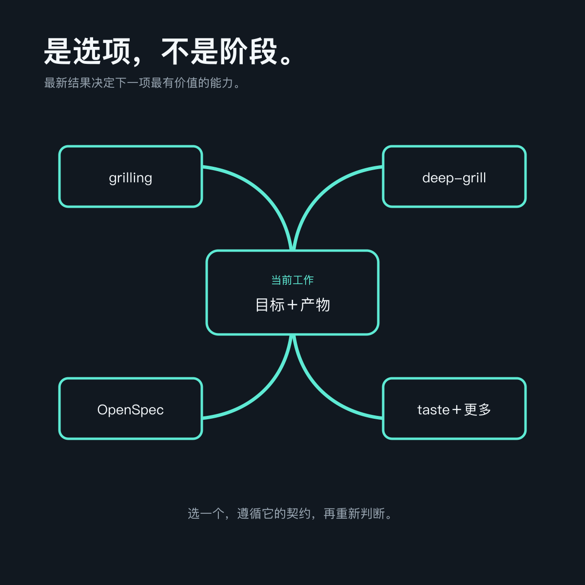
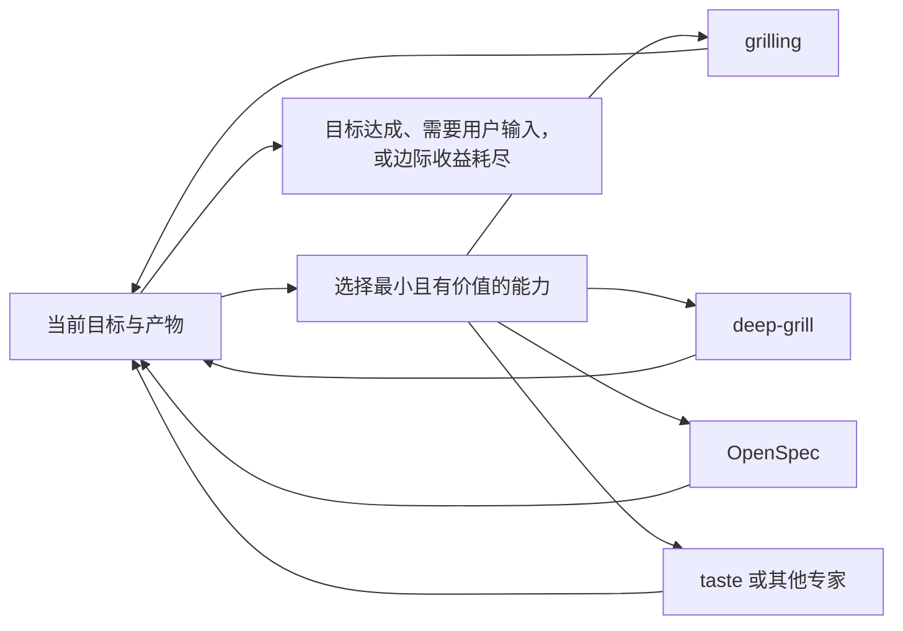

<p align="right">
  <a href="./README.md"></a>
</p>

<p align="center">
  
</p>

<h1 align="center">grill-loop</h1>

<p align="center"><strong>让循环跟着工作走。</strong></p>

<p align="center">
  一个显式调用的 Agent Skill：每次只选择当前最有价值的能力，<br>
  遵循它自己的契约，再根据新结果重新判断下一步。
</p>

<p align="center">
  <a href="#快速开始"></a>
  <a href="./LICENSE"></a>
  <a href="./README.md"></a>
</p>

真实工作很少沿着一套完美方法直线前进。模糊想法可能需要一次聚焦访谈，成形方案可能需要对抗审查，长期变更适合进入 OpenSpec，前端产物则可能需要 taste 复核。

**grill-loop 只负责把这些能力接起来，不把它们变成另一套框架。** 它观察当前目标和产物，只调用最有价值的能力，传递必要上下文，再根据变化重新选择。

## 正文就这么长

grill-loop 一共四段话。以下就是你要安装的完整 [`SKILL.md`](./SKILL.md) 正文：

<!-- grill-loop-skill-body:start -->
> # Grill Loop
>
> Follow the user's goal and the latest evidence or artifacts. Choose the smallest next useful capability, load and follow its own contract, then reassess from what changed. Briefly explain each transition; the user may choose the next capability at any time.
>
> Use `grilling` when a material answer lives only in the user's intent, priorities, risk tolerance, or taste. Use `deep-grill` when a plan or decision needs autonomous investigation and adversarial review. Use OpenSpec when the work should enter or continue durable exploration, specification, implementation, or archival. Use `design-taste-frontend` when a relevant frontend or brand surface needs visual direction or critique. Use another available skill or tool when it is a better next move.
>
> Treat these as options, not stages. Skip, repeat, reorder, or return to them freely. Load only what the current move needs. Carry forward the goal, confirmed decisions, constraints, and artifact references, but impose no shared output format and maintain no duplicate workflow state.
>
> Preserve every capability's own scope, authority, and safety boundaries. Add no custom gates, hooks, background processes, or state files. Stop when the user's goal is met, a meaningful next move requires their input or authority, or further looping has diminishing returns.
<!-- grill-loop-skill-body:end -->

四段各自负责：

- **只选一个有价值的动作。** 从当前目标和产物出发，而不是套固定生命周期。
- **按答案所在位置路由。** 用户意图、自主审查、长期规格、视觉品味或其他专家能力，各自保留原本的所有者。
- **自由流动。** 可以跳过、重复、重排或返回，不发明统一格式。
- **保持轻量。** 尊重授权边界，在目标达成或继续循环已无收益时停止。

## 快速开始

1. 安装 Skill：

   ```bash
   npx skills@latest add nxxxsooo/grill-loop
   ```

2. 继续现有任务，或从一个想法开始。

3. 说：

   > 使用 $grill-loop 继续这个任务。

> [!TIP]
> grill-loop 只在显式点名时触发。点名它只是选择路由器，不代表每项能力都必须运行。

## 是选项，不是阶段

<p align="center">
  
</p>

| 当前工作需要什么 | 适合的能力 |
| --- | --- |
| 重要答案只存在于用户脑中 | `grilling` |
| 方案需要调查和最强反驳 | `deep-grill` |
| 工作需要进入或更新长期变更材料 | OpenSpec |
| 前端或品牌表面需要视觉方向或复核 | `design-taste-frontend` |
| 其他专家能力更适合下一步 | 对应 Skill 或工具 |

这些只是默认选择，不是固定顺序。真实任务可以从 `deep-grill` 进入 OpenSpec，再切到 taste，回到实现；也可以只得到一个有用答案就停止。

## 如何流动



每次切换时，grill-loop 只传递下一项能力真正需要的目标、已确认决策、约束和产物引用。被选中的能力继续遵守自己的工作流和安全契约。

## 它不会增加什么

- 不增加强制顺序或生命周期。
- 不增加统一输出格式或重复任务清单。
- 不增加自定义门禁、hook、后台进程或状态文件。
- 不扩大用户授权，也不绕过被选能力的边界。
- 不自动触发。

## 更新

已安装副本不会自动跟随 GitHub commit 或 Release。更新全局安装：

```bash
npx skills@latest update grill-loop -g -y
```

项目级安装把 `-g` 换成 `-p`。这里的 `skills@latest` 选择 npm 上的安装器版本；Skill 内容仍来自本 GitHub 仓库。

## 手动安装

Claude Code 可手动安装：

```bash
git clone https://github.com/nxxxsooo/grill-loop ~/.claude/skills/grill-loop
```

## 许可证

[MIT](./LICENSE)
